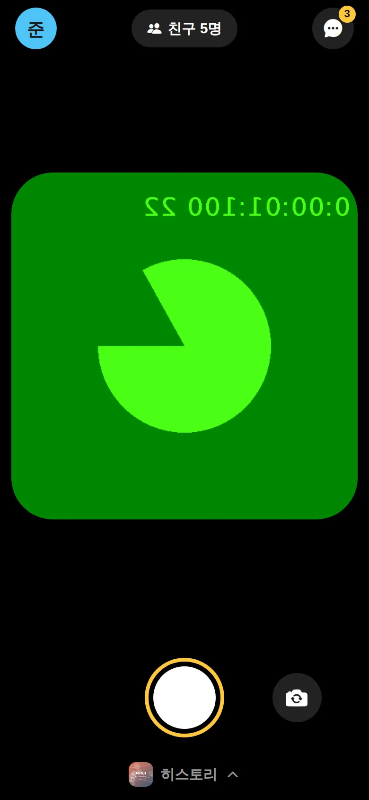
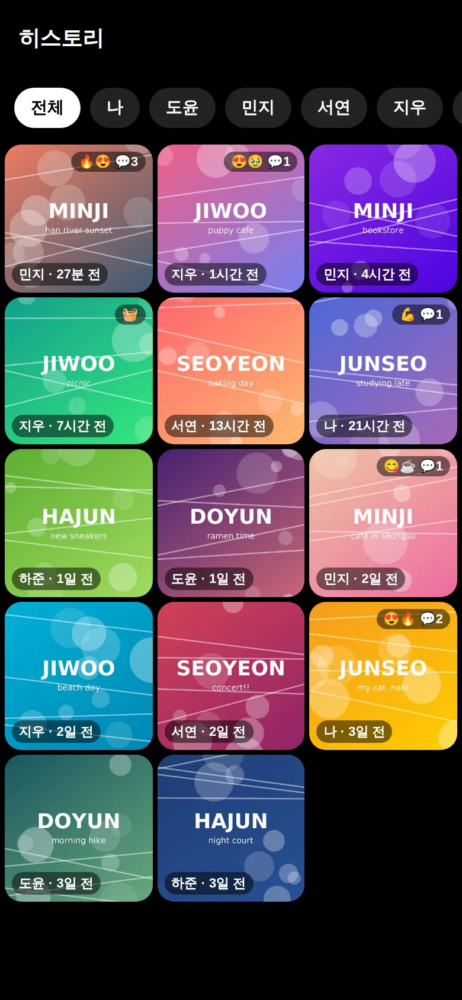
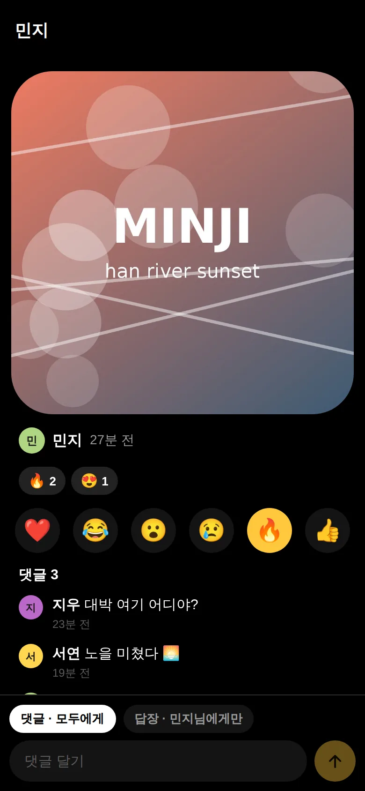
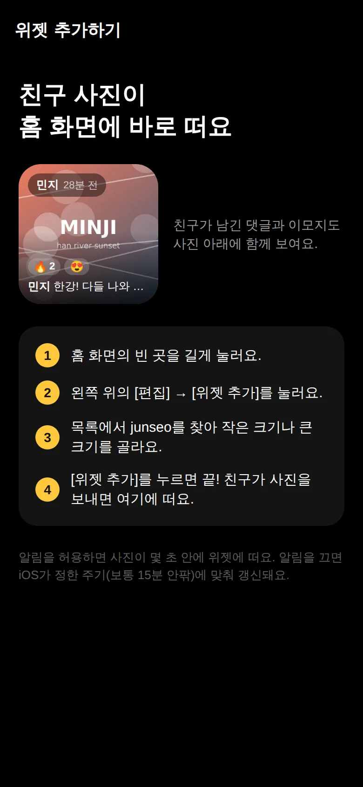
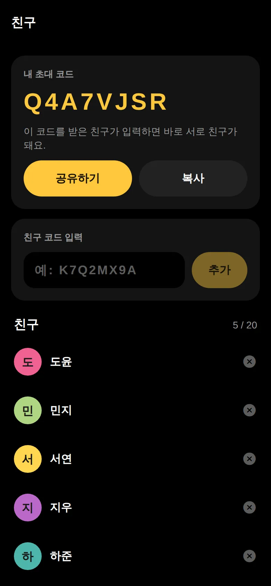
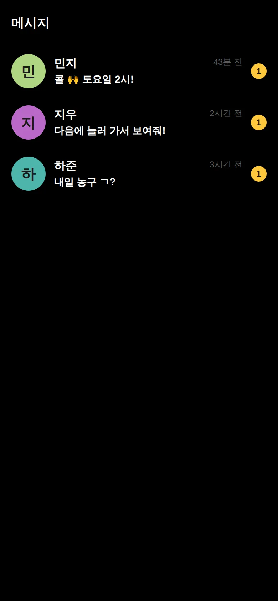
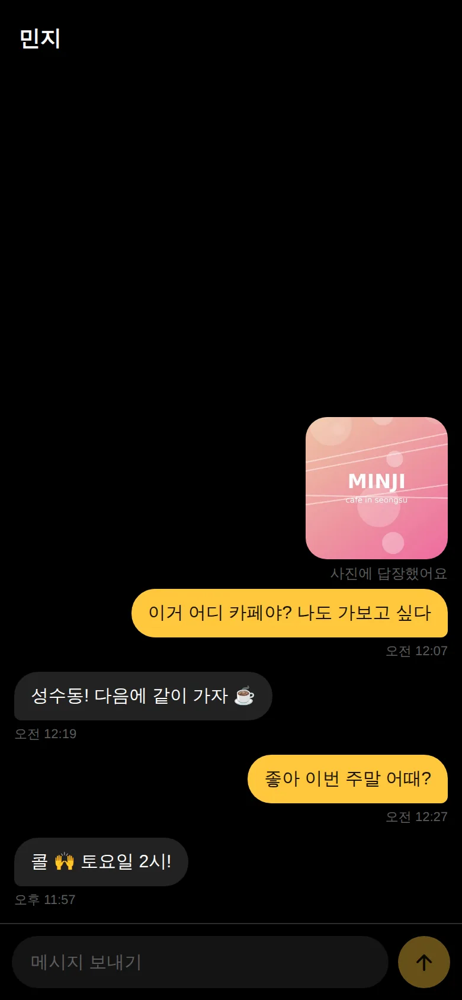
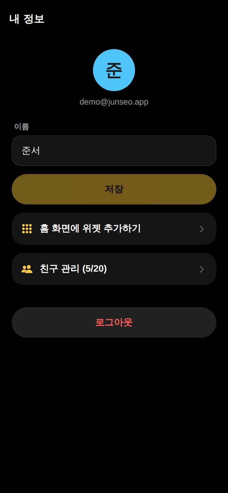

# junseo

**개발을 이어받는 분은 [HANDOFF.md](HANDOFF.md)부터 읽어 주세요.** 실제 Azure 서버, LiliPlanet 로그인, Firebase/Android 푸시, 서명키 전달, 빌드·배포 방법과 미완료 항목을 정리했습니다. 운영 DB는 V1~V7이고 병합한 안전 기능 V8은 아직 운영 미배포입니다.

친한 친구(최대 20명)가 찍은 사진이 **내 홈 화면 위젯에 바로 뜨는** iOS·Android 앱입니다.
위젯에는 사진과 함께 친구들이 남긴 **댓글**이 사진 아래에 같이 보입니다 (보낸 사람은 글자로, 이모지 반응은 앱에서만). 위젯 **양옆을 누르면** 하루 동안 받은 사진을 5장까지 넘겨 보고, 위젯 편집에서 **한 친구만** 고를 수도 있습니다. 사진에 **1:1 답장**을 보내면 대화로 이어집니다.
챗 탭 오른쪽 위 아이콘으로 **단챗**을 만들 수 있습니다 (모두가 서로 친구여야 함). 내가 보낸 메시지에는 안 읽은 사람 수(1:1 은 `1`)가 붙고, 읽으면 사라집니다. 같은 사람이 같은 분에 이어 보낸 메시지는 말풍선을 붙이고 시간은 마지막 말에만 씁니다 (단챗의 얼굴·이름은 첫 말에만).
보낼 때는 카메라 위 「친구 n명」을 눌러 **받을 친구를 고를** 수 있습니다 (기본은 친구 전체, 보내기 싫은 친구만 빼기). 단챗을 고르면 그 방 사람들이 한꺼번에 들어가고 빠집니다.
찍은 사진에는 기생충 포스터 같은 **눈 가리개**와 **텍스트**를 얹을 수 있고, 보낼 때 사진에 합성됩니다 (`react-native-view-shot`).
글자 모양은 기본 · 궁서체 · 길쭉(예능 썸네일처럼 세로로 긴 고딕 A1 ExtraBold, 세로 3.2배) 세 가지이고, 모두 흰 글자에 그림자입니다. 궁서체 글꼴은 은 궁서(은글꼴, GNU GPL 2.0)를 원본 그대로 `mobile/assets/fonts` 에 넣었습니다. App Store 에 내기 전에 라이선스를 확인하세요 (GPL 글꼴을 App Store 앱에 넣는 것은 해석이 갈립니다).
**렌즈** 를 켜면 어안 렌즈처럼 가운데가 볼록하게 휘어진 사진이 됩니다 (`@shopify/react-native-skia` 셰이더, 웹은 CanvasKit — `npm run web` 이 `public/canvaskit.wasm` 을 복사합니다).
화면은 디자인 랩에 저장한 디자인을 따릅니다: 로고 초록(#29FF01) 강조색, 그라데이션 바탕, 각진 버튼, 사진 모서리 60, 선 굵기 2.75 아이콘(`react-native-svg`), 「빠르게」 움직임 ×1.8, 이모지 날아오르기, 촬영 플래시, 보낼 때 사라지기. 값은 `mobile/src/lib/theme.ts` 에 모여 있습니다.
홈의 **오늘 템플릿**: 오늘 찍은 사진·받은 사진을 골라 템플릿 칸에 넣고, 보상형 광고를 한 번 보면 한 장이 완성됩니다 (사진첩 저장 · 공유 · 친구에게 보내기). 사진 칸은 카메라 화면처럼 정사각형에 같은 모서리 비율이고, 템플릿은 `mobile/src/lib/templates.ts` 에 그림(`mobile/assets/templates`) + 칸 위치·모서리로 추가합니다 (지금은 「뉴스」 · 「썸네일」 · 「미술관」 · 「지하철 광고」 · 「버스 광고」 · 「선수 카드」). 사진 위에 올라가는 글자는 투명 PNG(`overlay`)로 얹습니다. 비스듬한 판(지하철 · 버스)은 칸을 네 꼭짓점으로 적으면 사진을 원근에 맞춰 붙이고(`lib/warp.ts`), overlay 가 판 테두리(사진 끝 마감) · 조명과 그늘 · 유리/광택 반사 · 이음새를 다시 덮어 실제 인쇄물처럼 보이게 합니다. 지하철 광고판은 흐린 사진을 판보다 크게 깔아(`glow`) 사진 색 빛이 테두리 · 벽으로 번집니다. 그림과 overlay 는 `mobile/scripts/templates/make_templates.py` 로 원본 이미지에서 만듭니다. 이 6개는 앱에 기본으로 들어 있고, **출시 후 새 템플릿은 서버에 올리면 앱 업데이트 없이 바로** 모든 사용자에게 뜹니다 (아래 「출시 후 템플릿 추가」).

| 카메라 | 히스토리 | 사진 상세 | 위젯 안내 |
|---|---|---|---|
|  |  |  |  |

| 친구 | 메시지 | 채팅 | 내 정보 |
|---|---|---|---|
|  |  |  |  |

웹 미리보기로 서버와 앱을 같이 띄워 찍은 실제 화면입니다 (카메라 자리는 브라우저의 테스트 영상). 홈 화면 위젯은 iOS·Android 네이티브 빌드에서 확인합니다.

## 위젯이 갱신되는 방식

iOS 위젯은 계속 실행되는 프로그램이 아니라서, 앱이 원할 때마다 바로 바꿀 수 없습니다. 그래서 **사진은 미리 폰에 받아 두고, 다시 그리는 계기를 여러 개 겹쳐 겁니다.** 가장 먼저 도착한 계기가 위젯을 바꿉니다.

```
친구가 촬영 → POST /api/moments
  서버: 위치정보 제거 · 원본(1440px)과 위젯용 썸네일(540px) 생성
  서버 → APNs, 받는 친구마다 동시에
    ① 사진 알림 (mutable-content)  → 알림 서비스 확장이 /api/widget/latest 를 받아 캐시 저장 + 위젯 갱신 요청 + 알림에 사진 첨부
    ② 위젯 전용 푸시 (iOS 26+)      → WidgetKit 이 위젯 타임라인을 다시 불러옴
  위젯 타임라인: 15분 뒤 다시 확인하도록 예약 (푸시가 유실돼도 지연이 여기서 묶임)
  앱이 화면에 뜰 때: 즉시 갱신 (이때는 WidgetKit 예산이 차감되지 않음)
```

| 경로 | 구현 위치 | 왜 이 방법인가 |
|---|---|---|
| ① 알림 서비스 확장 | `mobile/targets/notification-service/NotificationService.swift` | 무음 푸시(Apple 권장 시간당 2~3회)와 달리 횟수 제한이 없고, 앱을 강제 종료해도 실행된다 |
| ② 위젯 전용 푸시 | `MomentWidgetPushHandler.swift`, 서버 `push` 패키지 | 앱을 깨우지 않고 위젯만 다시 불러오는 공식 경로 (iOS 26) |
| ③ 위젯 자체 예약 | `MomentWidget.swift` 의 `MomentProvider` | 마지막 안전망. 서버가 `ETag`/304 를 줘서 바뀐 게 없으면 바로 끝난다 |
| ④ 앱 실행 시 갱신 | `mobile/src/lib/widgetBridge.ts` | 예산 차감 없음 |

무음 푸시(`content-available`)는 쓰지 않습니다. ①이 모든 면에서 낫기 때문입니다.
그래도 iOS가 최종 시점을 정하므로 "완전 실시간"은 어떤 앱도 보장할 수 없습니다. 알림을 허용한 사용자는 대부분 몇 초 안에, 알림을 끈 사용자는 iOS가 정한 주기(보통 15분 안팎)에 맞춰 갱신됩니다.

## 구조

```
docs/api.md                 서버·앱·위젯이 함께 지키는 API 계약
backend/                    Spring Boot 4.1 · Java 21 · PostgreSQL · Flyway
mobile/                     Expo SDK 57 · React Native · Expo Router · TypeScript
  src/app/(tabs)/           아래 탭: 홈(사진 모아보기) · 카메라(첫 화면) · 챗
  src/app/                  그 밖의 화면 (사진 상세 · 1:1 대화 · 친구 · 내 정보 · 위젯 안내)
  src/lib/widgetBridge.ts   App Group 저장소로 위젯·알림 확장에 토큰과 서버 주소를 넘김
  src/lib/push.ts           알림 권한 · APNs 토큰 등록 · 알림 탭 처리
  src/lib/realtime.ts       채팅 WebSocket (신호를 받으면 그 대화만 다시 받음, 끊기면 재연결)
  src/lib/chatThread.ts     1:1·단챗 대화 저장소: 보내자마자 띄우기 · 순서 보장 · 같은 메시지 두 번 안 보내기 · 다시 들어가면 바로 보이기
  src/lib/chats.ts          대화 목록(목록·탭 배지 공용, 신호를 모아 한 번만 받음) · 목록에서 누르는 순간 미리 받기
  targets/_shared/          위젯과 알림 확장이 함께 쓰는 Swift 코드 (서버 동기화 · 캐시 · 이미지 축소)
  targets/widget/           홈 화면 위젯 (SwiftUI, 작은 크기·큰 크기) + iOS 26 위젯 푸시 처리
  targets/notification-service/  알림 서비스 확장
```

## 실행

### 서버
PostgreSQL 16 과 Java 21 이 필요합니다.

```bash
createuser junseo -P            # 비밀번호: junseo
createdb junseo -O junseo
createdb junseo_test -O junseo  # 테스트용

cd backend
./gradlew bootRun --args='--spring.profiles.active=dev'   # 테스트 데이터와 함께 시작
./gradlew test                                            # 통합·단위 테스트 126개
```

`dev` 프로필은 처음 시작할 때 테스트 데이터를 넣습니다. `demo@junseo.app` / `password123!` (준서)와 친구 5명(`minji@`, `jiwoo@`, `seoyeon@`, `hajun@`, `doyun@junseo.app`, 비밀번호 같음), 사진·반응·댓글·대화와 단챗 「한강 크루」(준서·민지·지우·서연)가 들어 있습니다.

| 설정 | 환경 변수 | 설명 |
|---|---|---|
| `spring.datasource.*` | `JUNSEO_DB_URL` · `JUNSEO_DB_USER` · `JUNSEO_DB_PASSWORD` | |
| `junseo.jwt.secret` | `JUNSEO_JWT_SECRET` | 32바이트 이상. 개발용 기본값이면 경고 로그 |
| `junseo.media.signing-secret` | `JUNSEO_MEDIA_SECRET` | 사진 URL 서명용. JWT 와 다른 값 |
| `junseo.storage.dir` | `JUNSEO_STORAGE_DIR` | 사진 저장 위치 (기본 `./data/media`) |
| `junseo.apns.enabled` · `key-id` · `team-id` · `bundle-id` · `key-path` | `JUNSEO_APNS_*` | 꺼져 있으면 보낼 푸시를 로그로만 남긴다 |
| `junseo.admin.token` | `JUNSEO_ADMIN_TOKEN` | 관리자 API(템플릿 올리기 · 신고 처리) 토큰. 비우면 관리자 API 가 꺼진다 |
| `junseo.admin.email` | `JUNSEO_ADMIN_EMAIL` | 신고가 들어오면 알림 메일을 받을 주소 |
| `spring.mail.host` · `port` · `username` · `password` | `JUNSEO_SMTP_HOST` · `_PORT` · `_USER` · `_PASSWORD` | 비밀번호 재설정 메일. 비우면 메일 대신 로그에 남긴다 (출시에는 꼭 필요) |
| `junseo.mail.from` | `JUNSEO_MAIL_FROM` | 보내는 사람 (기본 `잡다 <no-reply@junseo.app>`) |

### 앱 (웹 UI 미리보기)

현재 모바일 로그인은 LiliPlanet 방식입니다. 로컬 이메일 인증 서버와 웹 UI의 로그인 연결은 별도 작업이 필요합니다. 운영 웹 로그인은 [HTTPS 로그인 페이지](https://junseo-api.liliplanet.net/login)를 사용합니다. Android 네이티브 빌드는 [인계 문서](HANDOFF.md#6-android-빌드서명설치)를 따릅니다.

```bash
cd mobile
npm ci
npx expo start --web     # http://localhost:8081
```
서버 주소는 `EXPO_PUBLIC_API_URL` 로 바꿉니다 (`.env.example` 참고).

### 아이폰 (위젯·알림 확장 포함)
위젯과 알림 확장이 네이티브 코드라서 Expo Go 로는 열 수 없고 개발 빌드가 필요합니다. Apple 개발자 계정과 Xcode 26 이상(iOS 26 SDK)이 필요합니다.

```bash
cd mobile
APPLE_TEAM_ID=<팀 ID> EXPO_PUBLIC_API_URL=http://<PC의 LAN IP>:8080 npx expo run:ios --device
# Mac 이 없으면: npx eas-cli build --profile development --platform ios
```

- 광고(AdMob)는 앱 ID·보상형 광고 단위를 `ADMOB_IOS_APP_ID`, `ADMOB_IOS_REWARDED_ID` 로 줍니다. 비우면 Google 테스트 광고가 나옵니다. 맞춤 광고를 쓰지 않아서 추적 허용(ATT) 창은 띄우지 않습니다.
- 번들 ID 기본값은 `com.junseo.app`, App Group 은 `group.com.junseo.app` 입니다. 바꾸려면 `IOS_BUNDLE_ID` 를 주세요. 위젯·알림 확장은 자기 번들 ID 에서 App Group 을 계산하므로 따로 고칠 곳이 없습니다.
- 푸시를 받으려면 Apple Developer 에서 APNs 키(.p8)를 만들어 서버의 `JUNSEO_APNS_*` 에 넣습니다. 개발 빌드는 `development`, TestFlight·App Store 빌드는 `production` APNs 를 씁니다 (`eas.json` 의 `APNS_ENV`).

## 출시 후 템플릿 추가

새 템플릿은 서버에 올리면 그 순간부터 모든 사용자의 「오늘 템플릿」 맨 앞에 뜹니다. 앱은 목록과 그림을 받아 기기에 저장해 두므로, 한 번 받은 템플릿은 인터넷이 없어도 보입니다.

1. 원본 그림을 `mobile/scripts/templates/src/` 에 넣고 `make_templates.py` 에 그 템플릿 부분(칸 위치 · 그늘 · 반사 등)을 추가해 만든다: `python3 make_templates.py out > out/meta.json`
2. 서버에 올린다 (서버에는 `JUNSEO_ADMIN_TOKEN` 을 설정해 둔다):
   ```bash
   python3 mobile/scripts/templates/upload_template.py --api https://<서버> --token "$JUNSEO_ADMIN_TOKEN" \
       --dir out --id <id> --name "<앱에 보일 이름>" --color "#rrggbb"
   ```
   같은 id 로 다시 올리면 그림 · 칸이 통째로 바뀌고, `--hide` 로 내릴 수 있습니다.

- 지금 앱이 그릴 수 있는 것(네모 칸 · 네 꼭짓점 칸 · 앞장 그림 · 빛번짐) 안에서는 데이터만으로 됩니다. 새 효과가 필요한 템플릿은 그 효과를 넣은 앱 업데이트가 먼저 나가야 하고, 예전 앱에서는 그 템플릿이 자동으로 숨겨집니다 (`requires`).
- 템플릿 그림은 사진과 같은 저장소(`JUNSEO_STORAGE_DIR`)의 `templates/` 아래에 저장됩니다.

## 출시 전에 할 일 (안전 · 약관)

App Store 는 사진 · 채팅처럼 사용자가 올리는 내용이 있는 앱에 신고 · 차단 · 약관 동의 · 앱 안 계정 삭제를 요구합니다. 신고·차단·삭제·재설정 코드를 포함합니다. 플랫폼 계정의 삭제 재인증과 운영 V8 배포는 아직 필요합니다 ([인계 문서](HANDOFF.md#9-검증-범위와-다음-작업)).

- 약관 · 개인정보처리방침(`backend/src/main/resources/static/legal/`)의 `[운영자 이름]` · `[문의 이메일]` · `[시행일]` · `[서버 업체]` · `[메일 발송 업체]` · `[보호책임자 이름]` 채우기
- SMTP 설정(`JUNSEO_SMTP_*`) — 로컬 인증 재설정·신고 메일용. 플랫폼 계정의 비밀번호 관리는 LiliPlanet에서 처리
- `JUNSEO_ADMIN_EMAIL` 로 신고 알림 받기, 신고는 24시간 안에 `GET /api/admin/reports` 로 확인하고 지우기 · 내보내기 (`docs/api.md` 「신고 처리」)
- App Store 연령 등급 설문: 사용자 간 대화 · 사진이 있으므로 그에 맞게 답한다

## 검증 상태

- Android: `0.1.2` APK 배포, 로그인·업로드 회귀 13개 통과. 네이티브 위젯·FCM 설정과 서버 발송 구현. 실제 두 기기 수신 검증은 남음
- 서버: 통합·단위 테스트 126개 통과 (실제 PostgreSQL)
- 앱: TypeScript 타입 검사, ESLint 통과. 웹 미리보기에서 서버와 같이 띄워 화면 9개가 실제 데이터로 오류 없이 동작
- 채팅: 웹 미리보기(배포용 빌드)에서 앱 전환 · 소리 없이 죽은 연결 · 응답 유실 · 응답 없음 · 300개 넘는 대화방을 재현해 확인. 키보드 위치와 「보고 있는 방 알림 숨기기」는 아이폰에서만 확인할 수 있어 아직
- iOS: `expo prebuild` 로 Xcode 프로젝트 생성 확인 (위젯·알림 확장 타깃, App Group, 푸시 권한, 앱·위젯·알림 확장 모두 최소 iOS 17). GitHub Actions 의 Mac 에서 앱·위젯·알림 확장을 Xcode 로 빌드하고 시뮬레이터에서 앱을 켜 본다 (`.github/workflows/ios.yml`). **실기기 확인은 아직** — 점검표: `docs/widget-check.md` (새 사진이 위젯에 닿기까지 걸린 시간은 서버 로그 `Widget got new photo` 로 잰다)

## 다음 할 일

- Xcode 에서 첫 빌드, 실기기에서 위젯 갱신 시간 측정 (알림 허용·거부 각각)
- 중앙 토큰 갱신·계정 변경 연동 (iOS 공유 Keychain·Android Keystore 저장은 구현 완료)
- Azure Blob 사진 삭제 재시도·URL 회수 정책·복구 검증 (비공개 Blob 저장은 운영 적용)
- 서버를 여러 대로 늘릴 때 채팅 신호를 Redis pub/sub 로 나누기 (지금은 서버 한 대의 메모리에서 WebSocket 연결 관리)
- 눈 가리개 자동 위치: iOS Vision 얼굴 인식으로 눈 위에 바로 얹기 (지금은 손으로 옮기고 두 손가락으로 크기·각도 조절)
