# 도시 설계도 v7 — 약 3.2×1.8km, 도로망 완성, 첫 건물

> 운영자 손그림 스케치(2026-10-04)를 블록 좌표로 옮긴 설계도입니다. 1블록 = 1m입니다.
>
> **v7 (2026-10-05) 변경 [확정]**
> - 구역별 오픈 차수(1·2·3차)를 없앴습니다. **도시 전체를 한 번에 엽니다.**
> - 그래서 구역 경계에 깔던 차수별 색 콘크리트 줄(주황·연두·하늘색)도 없앴습니다. 실제 거리에는 없는 표시라서입니다.
>
> **v6 (2026-10-05) 변경**
> - 운영자 기획 문서(구역별 건물 콘셉트)에 따라 **공항·청라·구인천·대형시장 건물을 생성기가 짓습니다.** 자세한 내용은 [9. 건물](#9-건물-생성기가-짓는-것)을 보세요.
> - 터미널 앞 계류장(비행기 세우는 곳) 자리를 내려고 **활주로를 북서쪽으로 30칸 옮겼습니다.** 도로는 그대로입니다.
>
> **v5 (2026-10-05) 변경 [확정]**
> - 고속도로 말고는 **모든 길을 왕복 4차로(대로 규격)로 통일**했습니다. 왕복 2차로 중로는 없앴습니다.
> - 횡단보도 줄무늬를 차도 폭 전체에 1칸 간격으로 고르게 그립니다.
>
> **v4 (2026-10-05): 도로망 최종 설계**
> - 이 크기(약 3.2×1.8km)로 확정했습니다.
> - 큰길(고속도로 3개, 대로 15개)을 새로 설계했습니다. 모든 길이 다른 길에 닿고, 도시 전체가 한 도로망으로 이어집니다.
> - 구역마다 길을 격자로 깔았습니다.
> - **다리를 따로 그리지 않습니다.** 물을 건너는 도로가 저절로 다리가 되므로 차선이 끊기지 않습니다.
> - 교차로 양쪽에 횡단보도를 그립니다.
>
> **v3 (2026-10-05)**
> - **넓이를 다시 절반으로 줄였습니다.** 가로·세로를 각각 0.7배 해서 약 3.2×1.8km가 됐습니다.
>   - 강 폭, 섬, 산 크기도 같은 비율로 줄였습니다. 산 높이는 0.85배입니다.
>   - 도로 폭은 실제 크기 그대로입니다.
>
> **v2 (2026-10-05)**
> - 처음 크기(9×5km)가 너무 커서 절반(약 4.5×2.5km)으로 줄였습니다.
> - 공항을 섬으로 떼어 냈습니다(영종도처럼). 해협 위로 고속도로 다리 2개가 건너갑니다.
>
> **파일**
> - 데이터(기준 원본): [`map/layout.json`](../map/layout.json)
> - 그림 만들기: `python3 map/render_layout.py map/layout.json docs/images/map-v1.svg`
> - 크기 다시 바꾸기: `python3 tools/scale_layout.py map/layout.json 배율 [--height 산높이배율]`
> - 구역 안 길 다시 깔기: `python3 tools/design_streets.py map/layout.json` (구역별 격자 설정은 `street_plan`)
>
> **표기**
> - **[확정]** 운영자가 정한 것
> - **[제안]** 초안이며 바꿀 수 있는 것

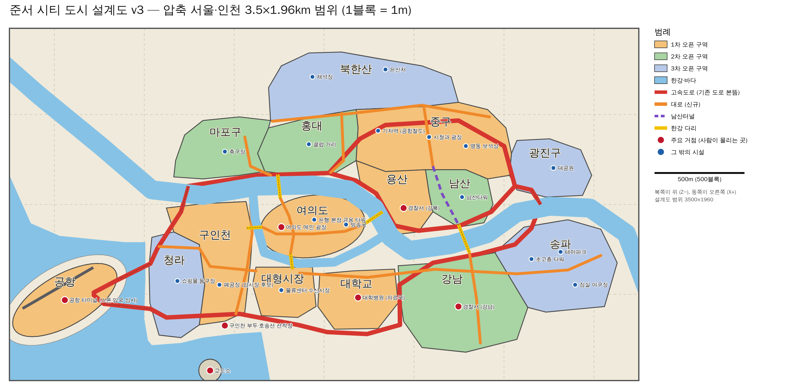

---

## 1. 좌표 기준

| 항목 | 값 |
|---|---|
| 방향 | 위가 북쪽(Z−), 오른쪽이 동쪽(X+). 마인크래프트 좌표와 같습니다 |
| 원점 (0, 0) | 지도 한가운데. 여의도 동쪽 끝 근처입니다 |
| 도시 크기 | 약 3.2×1.8km [확정: v2의 넓이 절반]. 구역 끝에서 끝까지 재면 동서 약 3.4km, 남북 약 1.7km |
| 설계도 범위 | 3.5×1.96km (X −1750~1750, Z −980~980). 바다, 교도소 섬, 한강 양 끝이 들어갑니다 |
| 월드 경계 | 한 변 3.5km 정사각형. 설계도 바깥은 깊은 바다라서 섬 도시처럼 보입니다 |
| 구역 넓이 합 | 약 2.6km² |
| 이동 시간 (동서 끝에서 끝) | 세단(72km/h) 약 3분, 스포츠카 약 2분, 뛰기 약 10분 |

---

## 2. 구역표

「중심」은 구역 경계 상자의 가운데, 「크기」는 동서×남북 폭입니다.

| 구역 | 중심 (X, Z) | 크기 | 시설 [확정] |
|---|---|---|---|
| 여의도 ★메인 | −65, 122 | 584×350m | 한강공원 메인 광장, 은행 본점, 금융 타워, 방송국 |
| 공항 (섬) | −1442, 532 | 580×407m | 터미널, 세관, 활주로 |
| 중구 | 610, −355 | 864×426m | 시청과 광장, 명동 거리, 기차역 |
| 용산 | 392, −38 | 427×411m | 영화관, 공원, 이태원 거리 |
| 대학교 | 188, 527 | 447×334m | 캠퍼스, 연구소, 기숙사, 대학병원 |
| 구인천 | −638, 327 | 479×686m | 부두, 컨테이너 야적장, 폐공장 |
| 대형시장 | −222, 489 | 353×280m | 수산시장, 물류센터 |
| 마포구 | −567, −314 | 538×345m | 축구장, 공원, 아파트 단지 |
| 홍대 | −90, −345 | 559×366m | 클럽 거리, 버스킹 거리, PC방 |
| 남산 | 752, −34 | 375×319m | 남산타워, 남산터널 |
| 강남 | 772, 545 | 721×554m | 기업 본사들, 부촌, 경찰서(강남) |
| 청라 | −819, 447 | 310×588m | 대형 쇼핑몰, 돔구장, 신도시 분양 필지 |
| 광진구 | 1260, −203 | 457×324m | 대공원, 빌라·원룸촌 |
| 북한산 | 219, −658 | 1056×381m | 등산로, 채석장, 은신처 |
| 송파 | 1290, 342 | 680×514m | 테마파크, 초고층 타워, 잠실 야구장 |

- 종로는 빼고, 그 자리를 중구와 북한산이 나눠 가졌습니다 [확정].
- 구역별 오픈 차수는 없습니다. 도시 전체를 한 번에 엽니다 [확정] (기획서 6.6).

---

## 3. 거점 좌표 [제안]
Folia는 가까이 모인 사람을 한 묶음(스레드 하나)으로 처리합니다. 그래서 사람이 몰리는 곳은 되도록 500m 가까이 떨어뜨렸습니다.

| 거점 | 구역 | 좌표 (X, Z) |
|---|---|---|
| **공항 터미널** (스폰·입국 심사) | 공항 | −1427, 556 |
| **여의도 메인 광장** | 여의도 | −237, 110 |
| 은행 본점·금융 타워 | 여의도 | −55, 85 |
| 방송국 | 여의도 | 124, 119 |
| **대학병원** (의료국) | 대학교 | 189, 527 |
| **경찰서 (강남)** — 도시 유일한 경찰서 | 강남 | 747, 568 |
| 이태원 거리 | 용산 | 399, −152 |
| 기차역 (공항철도 도착) | 중구 | 284, −410 |
| 시청과 광장 | 중구 | 584, −375 |
| 명동 보석상 | 중구 | 788, −325 |
| **구인천 부두·호송선 선착장** | 구인천 | −550, 682 |
| 폐공장 (암시장 후보) | 구인천 | −582, 447 |
| 물류센터·수산시장 | 대형시장 | −238, 477 |
| 클럽 거리 | 홍대 | −85, −335 |
| 축구장 | 마포구 | −552, −278 |
| 남산타워 | 남산 | 767, −41 |
| 채석장 / 은신처 | 북한산 | −65, −710 / 341, −751 |
| 대공원 | 광진구 | 1275, −203 |
| 테마파크 / 초고층 타워 / 잠실 야구장 | 송파 | 1317, 272 / 1153, 304 / 1396, 447 |
| 쇼핑몰·돔구장 | 청라 | −816, 426 |
| **교도소** | 교도소 섬 | −634, 924 |

- 산속(채석장·은신처·남산타워)과 교도소 섬을 빼고, 모든 거점은 길 가장자리에서 3~30m 안에 있습니다(자동 검사).

- **거점 사이 거리**

  | 구간 | 거리 |
  |---|---|
  | 광장 – 대학병원 | 600m |
  | 대학병원 – 강남 경찰서 | 560m |
  | 공항 – 광장 | 1.3km |
  | 부두 – 교도소 | 260m |

- 여의도 안의 광장, 은행 본점, 방송국은 약 180m씩 떨어져 있습니다.
- 사람이 많이 몰려서 느려지는 곳이 생기면 거점을 옮깁니다.

---

## 4. 물과 섬

| 항목 | 내용 |
|---|---|
| 한강 | 폭 105m, 가운데 깊이 10칸. 북서쪽(하구)에서 들어와 도시를 가로지르고 남동쪽으로 나갑니다 |
| 샛강 | 여의도 남쪽의 좁은 물길, 폭 49m, 깊이 4칸. 그래서 여의도는 섬입니다 |
| 서해 | 지도 서쪽 끝과 청라·구인천 남쪽 [확정]. 해안에서 멀어질수록 깊어집니다(최대 20칸) |
| 공항 섬 [확정] | 공항을 둘러싼 섬입니다(약 760×380m). 청라와는 폭 약 110m의 해협으로 떨어져 있습니다 |
| 교도소 섬 | 구인천 부두에서 남쪽으로 약 250m, 지름 약 125m [확정: 구인천 앞바다 섬] |

---

## 5. 도로 [확정: v4 도로망]

**원칙**
- 막다른 길이 없습니다. 모든 길의 끝은 다른 길에 닿습니다(활주로만 예외).
- 도시 전체가 한 도로망입니다. 어느 길에서 출발해도 모든 길에 갈 수 있습니다.
- 다리는 따로 없습니다. 물을 건너는 도로가 그 폭·차선 그대로 다리 상판이 됩니다(난간, 40칸마다 기둥).
- 위 세 가지와 「거점이 길 바로 옆에 있는지」는 자동 검사(`RoadNetworkTest`)가 지킵니다.

| 종류 | 폭 | 차선 표시 |
|---|---|---|
| 고속도로 (빨강) | 28블록: 왕복 6차로 | 노란 중앙선 2칸, 흰 차선 점선, 바깥 실선. 횡단보도 없음 |
| 대로 (주황) — 고속도로 외 모든 길 | 24블록: 왕복 4차로 + 인도 4칸씩 | 노란 중앙선, 흰 차선 점선·가장자리선, 교차로 양쪽 횡단보도(5칸, 1칸 줄무늬) |
| 남산터널 | 12블록: 왕복 2차로 + 보행로 | 노란 중앙선, 천장 조명 |
| 공항 활주로 | 45블록 | 흰 가운데 점선 |

**고속도로 3개**

| 도로 | 경로 |
|---|---|
| 공항고속도로 | 공항 → 해협 대교 → 청라 → 구인천 → 한강 다리 → 마포 서쪽 |
| 강변북로 | 마포 서쪽 → 한강 북쪽 강변(마포·홍대·용산·남산 아래·광진) → 동쪽 다리 |
| 올림픽대로 | 동쪽 다리(광진↔송파) → 한강 남쪽 강변(송파·강남) → 샛강 남쪽(대학교·대형시장) → 구인천·청라 → 해협 대교 → 공항 |

- 세 고속도로가 도시를 한 바퀴 두릅니다.

**대로 15개**

| 도로 | 경로 |
|---|---|
| 북부대로 | 북쪽 바깥 고리: 마포 서쪽 → 북한산 아래 → 중구 → 광진 → 동쪽 다리 |
| 율곡로 | 북쪽 가운데 동서축: 마포 → 홍대 → 중구 → 광진 |
| 마포대로 | 마포 남북 |
| 홍대입구로·마포대교·여의대방로 | 홍대 → **마포대교** → 여의도 → **샛강다리** → 대형시장 |
| 세종대로 | 중구 → 용산 남북 |
| 남산로 → 남산터널 → 한남대로·강남대로 | 중구 → 남산 아래 터널 → **한남대교** → 강남 남북 |
| 여의대로·원효대교 | 청라·구인천 → **서강대교** → 여의도 동서 → **원효대교** → 용산 |
| 구인천대로, 청라대로 | 구인천·청라 남북 |
| 대학로·샛강다리 | 여의도 → **샛강다리** → 대학교 남북 |
| 송파대로·잠실대교 | 광진 → **잠실대교** → 송파 남북 |
| 남부대로 | 남쪽 가운데 동서축: 청라 → 구인천 → 대형시장 → 대학교 → 강남 → 송파 |
| 남부순환로 | 남쪽 바깥 고리: 청라 해안 → 부두 → 대학교 → 강남 → 송파 → 동쪽 다리 |
| 공항로 | 공항 터미널 앞 고리 |
| 남산 서쪽길 | 용산과 남산 사이 |

**구역 안 길** (대로와 같은 규격)
- 구역마다 격자로 깝니다(간격 약 105~135m, 구역마다 다름). 큰길과 나란히 바짝 붙는 자리, 물가, 산, 활주로는 비웁니다.
- 도시 구역 안의 모든 곳이 가장 가까운 길 가장자리에서 대략 60~100m 안입니다(블록 하나 크기).
- 길이: 고속도로 6.6km, 큰 대로 18.7km, 구역 안 길 53개 14.5km.

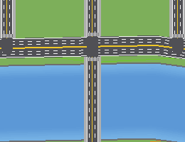 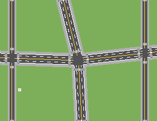

---

## 6. 높이

| 항목 | 높이 |
|---|---|
| 땅 | Y 0 [확정] |
| 한강·바다 수면 | Y −1 |
| 지하 공간 | Y −64~0 (지하철, 지하주차장, 하수도 은신처) |
| 남산 정상 | 약 150m (도시가 작아져서 산도 낮춤) |
| 북한산 정상 | 약 190m |
| 초고층 타워 | 최대 Y 320 |

---

## 7. 바탕 월드 만들기
**도시 바탕 생성기(`JunseoMapGen`)**가 이 설계도로 땅, 한강, 바다, 산, 도로, 다리, 터널을 자동으로 깝니다. 사용법은 [`mapgen/README.md`](../mapgen/README.md)를 보세요.

확대 그림(1px = 1블록): [여의도](images/mapgen-yeouido-1to1.png), [남산터널](images/mapgen-namsan-tunnel-1to1.png), [공항 섬](images/mapgen-airport-1to1.png)

**순서**
1. 설계도 확정 ✅
2. 바탕 월드 자동 생성 ✅ (생성기 완성)
3. **구역 채우기:** 생성기가 기획 문서대로 짓습니다. 손으로 다듬을 곳은 WorldEdit으로 고칩니다.
   - 공항·청라·구인천·대형시장 ✅ ([9. 건물](#9-건물-생성기가-짓는-것))
   - 나머지 구역(여의도, 마포, 홍대, 중구, 용산, 남산, 대학교, 강남, 송파, 광진) — 기획 문서를 받으면 이어서
4. **랜드마크 짓기:** 공항 터미널 ✅, 청라돔 ✅, 남산타워, 금융 타워, 방송국, 초고층 타워, 교도소 등
5. **운영 서버로 옮기기:** 완성되면 Folia 운영 서버로 복사합니다. 도시 전체를 한 번에 엽니다.

---

## 8. 게임 속 지도 (미니맵·큰 지도)
이 설계도로 게임 안 지도도 만듭니다(본 플러그인). 모드 없이, 접속할 때 자동으로 받는 **리소스팩**으로 그립니다 [확정].

| | 미니맵 (GTA 레이더) | 큰 지도 (GTA 일시정지 지도) |
|---|---|---|
| 여는 법 | 늘 떠 있음. 아무것도 들 필요 없음 [확정] | **F키** [확정] (총을 들면 F는 재장전, Shift+F는 손 바꾸기) |
| 자리 | 화면 아래 핫바 왼쪽 (설정으로 오른쪽) | 화면 가운데 창 |
| 방향 | 보는 방향이 위 [확정], 가장자리에 북쪽(N) 표시 | 북쪽이 위 |
| 범위 | 걸을 때 약 580×380m, 차를 타면 약 960×640m [확정: 더 넓게] 앞쪽을 더 넓게 보여 줌 (걸을 때 앞 약 220m) | 도시 전체 → 구역 → 동네 3단계 확대, 화살표로 이동 |
| 표시 | 내 화살표, 길 안내 목적지(보라색, 밖이면 가장자리), 주요 장소 아이콘 | 같음 + 내 방향 화살표 |
| 마우스 | 없음 | 올리면 구역·장소 이름, 누르면 그곳으로 길 안내 |

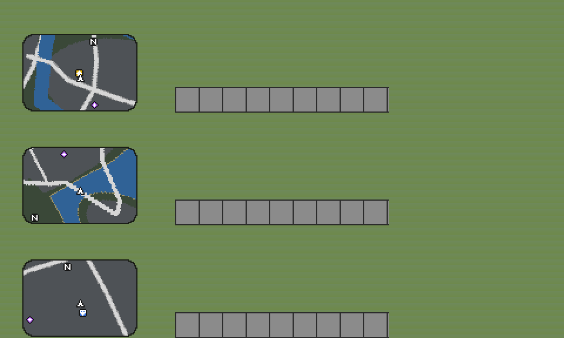

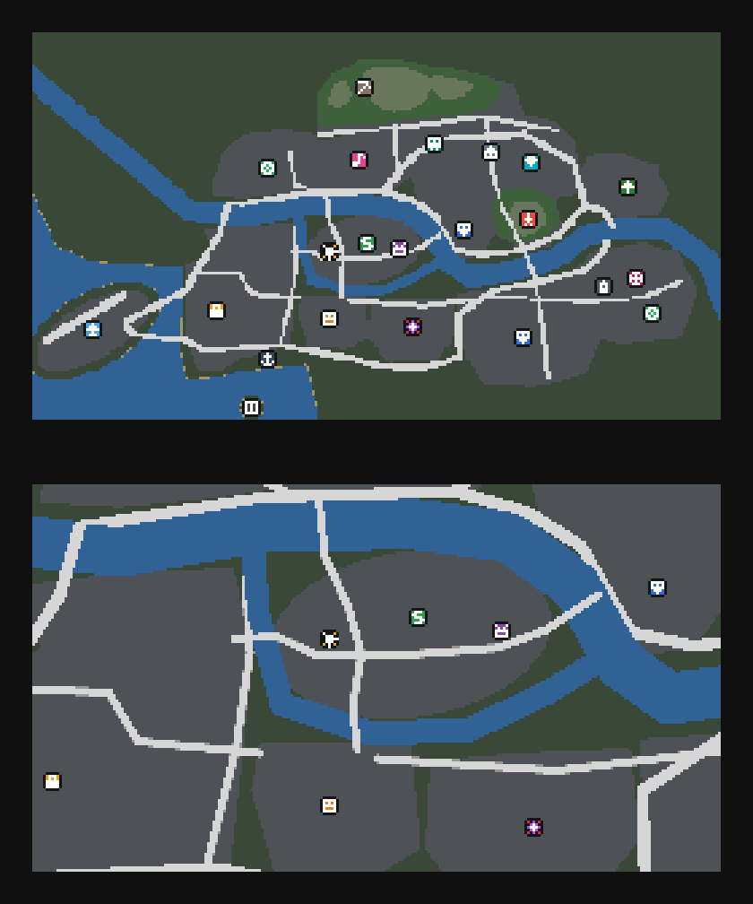

- 그림은 테스트가 클라이언트 규칙대로 그려 본 것입니다. 실제 게임 화면은 아직 확인하지 않았습니다.
- 장소 아이콘: 공항(하늘색), 메인 광장(노랑 별), 은행($), 방송국, 병원(빨간 십자), 경찰서(파랑), 시청, 기차역, 보석상, 부두(닻), 물류센터, 채석장, 클럽, 경기장, 남산타워, 공원, 테마파크, 초고층 타워, 쇼핑몰, 교도소.
- 암시장·은신처 같은 범죄 장소는 지도에 나오지 않습니다.

### 어떻게 그리나 (개발 메모)
- 리소스팩 글꼴 하나(`junseocity:map`)에 "1칸 높이 색 막대" 글자를 줄·색·길이마다 만들어 둡니다. 서버는 지도를 줄마다 같은 색끼리 묶어서 그 글자들로 보냅니다.
- 미니맵은 **액션바**로 보냅니다. 한 장에 평균 약 3.7KB이고, 건물이 빽빽한 구인천·대형시장에서는 평균 약 8KB(최대 약 10KB)입니다. 건물 사이 한 칸짜리 골목은 미니맵에서 메워서 덩어리로 보여 줍니다. 움직이거나 돌 때만 다시 그립니다(최소 0.15초 간격). 멈춰 있으면 1.5초마다 같은 것을 다시 보냅니다(액션바가 3초 뒤 사라지므로).
- 다른 알림(장전 중, 속도 등)도 같은 액션바에 함께 나옵니다. 알림 글자 폭을 계산해서 미니맵이 흔들리지 않게 합니다.
- 큰 지도는 **대화창**으로 보냅니다(약 40KB, 열 때 한 번). 보이지 않는 16×16 칸들이 마우스 이름과 클릭을 받습니다.
- 리소스팩이 없는 사람은 미니맵이 안 보이고, F키는 장소 목록(길 안내)으로 바뀝니다.

---

## 9. 건물 (생성기가 짓는 것)
운영자 기획 문서(2026-10-05)의 구역별 콘셉트대로, 바탕 생성기가 땅·도로를 깔면서 건물도 함께 짓습니다.
같은 설계도면 언제나 같은 건물이 나옵니다(무작위지만 설계도로 정해짐).
**게임 같은 장식이 아니라 실제 한국 거리처럼** 만드는 것이 원칙입니다 [확정: 운영자 요청].

| 구역 | 기획 문서 | 지은 것 |
|---|---|---|
| 공항 (섬) | 인천공항 터미널 형태, 공항 앞 도로 주변은 처음 온 사람에게 위압감을 주는 거대한 조형물 | 활 모양 여객 터미널(약 195m, 물결 지붕, 전면 유리벽, 출국장 차양과 앞 보도, 체크인 카운터·기둥·출발 안내판), 탑승교 4개, 여객기 3대, 관제탑(약 65m), 섬으로 들어오는 고속도로 두 개 위 거대한 **홍살문**(높이 40), 길 양옆 **무인석(돌 장군상, 높이 40) 12개**, 공항로 고리 안 **지구본 조형물**과 주차장 |
| 청라 | 새로 생길 청라돔 (스타필드는 보류) | 쇼핑몰·돔구장 거점 블록에 **청라돔**(약 87×107m, 높이 37). 바깥: 흰 세로 핀과 유리 벽, 빨간 띠, 흰 돔 지붕(방사형 살과 동심원 띠, 유리 천창). 안: 둥근 복도, 빨간 관중석 11줄(홈 뒤 흰 좌석), 관중석 통로 8곳, 4칸 낮춘 야구장, 「청라」 전광판, 지붕 조명. 정문 앞 광장 |
| 구인천 | 저층 위주의 저가 건물들, 공장들 | **다세대·빌라**(붉은 벽돌·베이지 타일·흰 벽, 1층 필로티 주차장과 세워 둔 차, 알루미늄 창과 창턱, 2층 방범창, 발코니, 계단실 세로 창, 실외기, 노란 가스관, 문패, 초록 방수 옥상·물탱크·옥탑 계단실·안테나), **상가주택**(1층 가게와 간판·차양), **공장**(패널 벽, 파란 지붕, 톱니 지붕, 셔터 문, 회사 간판, 굴뚝, 사무동, 철망 울타리), 암시장 거점 옆 **폐공장** |
| 대형시장 | 광장시장 느낌의 화려하면서 거대한 시장 (광장시장은 야외가 아니라 큰 건물 안) | 물류센터·수산시장 거점 블록에 **시장 건물 하나**(약 94×69m, 3층, 가운데 홀 높이 30). 바깥: 베이지 타일 건물, 1층 둘레 가게 간판, 큰 문 네 곳에 차양과 남색 간판(「전통시장」「대형시장 남문」). 안: 십자로 뚫린 3층 높이 홀과 철골 유리 지붕, 동서 홀은 **먹자골목**(스테인리스 좌판에 빈대떡 불판·솥, 양옆 긴 나무 의자, 좌판마다 「순희네 빈대떡」 같은 매단 표지판), 홀 양옆 반찬·떡집·건어물·청과·수산·방앗간 가게, **2층**은 난간 복도와 원단·한복·이불 가게, 계단 4곳. 나머지 블록은 층마다 간판이 붙은 4~6층 **상가 건물** |

**거리 (구인천·대형시장·청라·공항)**
- 동네 빈 땅은 포장합니다: 길가는 인도와 이어지는 보도, 안쪽은 골목 아스팔트. 구역 경계선(색 줄)과 거점 표시 기둥은 걷어 냅니다(거점 좌표는 그대로라 게임에는 영향 없음).
- 인도 연석 쪽 한 줄에 가로수(나무 구덩이), 가로등(차도 쪽으로 뻗은 팔), 전봇대와 전깃줄, 버스 정류장을 둡니다. 걷는 길과 차도는 막지 않습니다.

**간판**
- 단색 간판 판에 **진짜 표지판 글씨**(「행복약국」「온누리수학학원 2층」「순희네 빈대떡」처럼 실제 같은 상호, 밤에 빛나는 글씨)를 붙입니다. 돌출 간판은 벽에서 튀어나온 매다는 표지판입니다.
- 표지판 글씨는 블록 엔티티라서 생성 단계에서 바로 쓸 수 없습니다. 생성기가 **청크를 처음 불러올 때** 글씨를 쓰고, 고칠 수 없게 밀랍칠합니다. 글씨가 빈 표지판이 보이면 `/mapgen signs`로 다시 씁니다.
- 큰 픽셀 글자, 글씨 흉내 무늬, 원색 진열 같은 게임 같은 장식은 쓰지 않습니다. 전광판처럼 원래 점으로 된 화면만 블록 글자를 씁니다.

- 건물은 길·다리·물 위를 막지 않습니다(도로 위로는 6칸보다 높은 곳만: 홍살문 가로대, 터미널 차양). 거리 시설은 인도에만 서고 차도 위로는 4칸 위(나뭇가지, 가로등 팔)만 지나갑니다.
- 상자, 침대, 현수막처럼 블록 엔티티가 있어야 보이는 블록은 쓰지 않았습니다(표지판은 위처럼 따로 씀).
- 아직 실제 게임 화면으로는 확인하지 않았습니다. 아래 그림은 테스트가 생성 결과를 그대로 그린 것입니다(눈높이 그림은 블록 모양·유리·그림자를 흉내 낸 것, 표지판 글씨는 안 보임).

**눈높이 그림**: 대형시장 앞 큰길 / 구인천 큰길 / 구인천 골목 / 시장 안 먹자골목 / 청라돔 정문 / 공항 출국장 앞

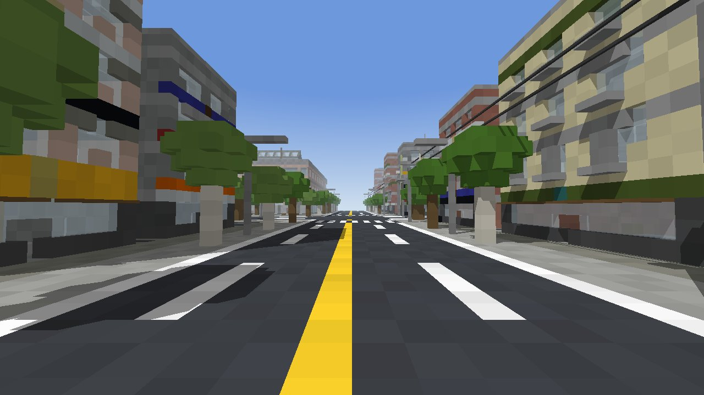
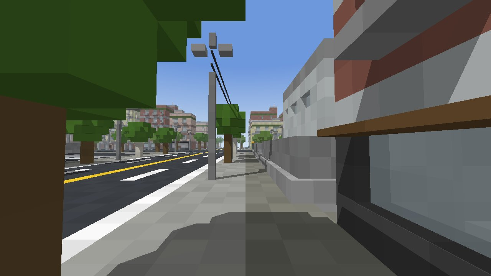
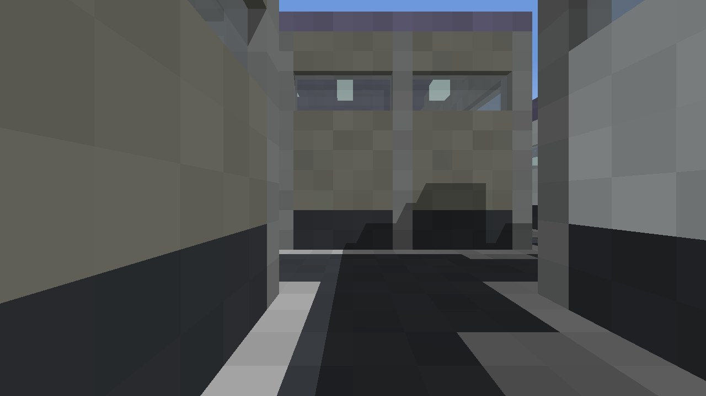
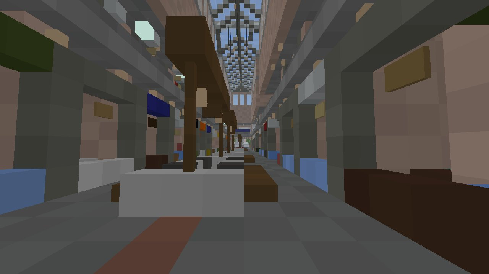
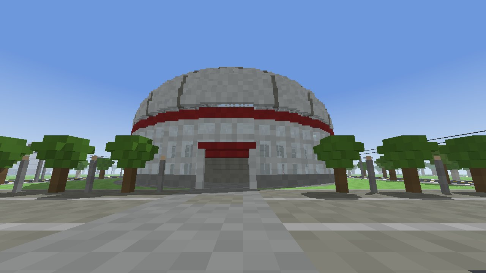
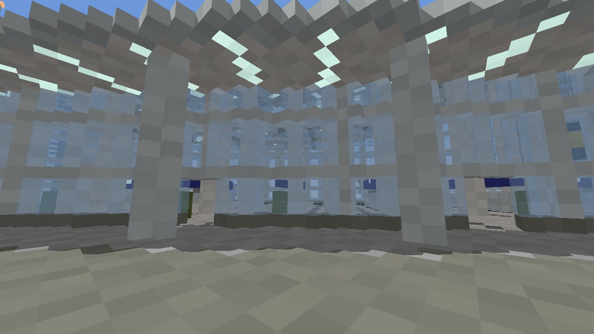

**위에서 비스듬히 본 그림**: 구인천 / 대형시장 / 시장 2층(지붕 걷어 냄) / 공항 섬 / 진입로의 무인석과 홍살문 / 청라돔 바깥과 안

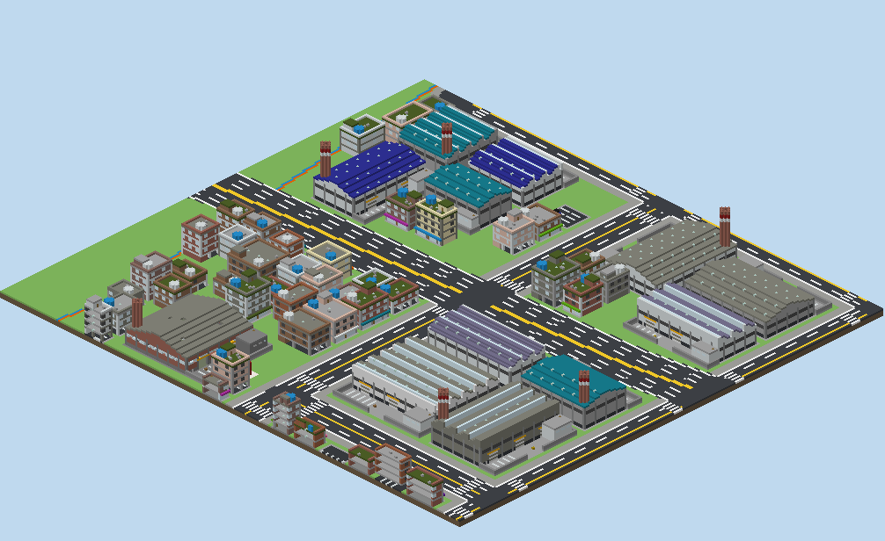
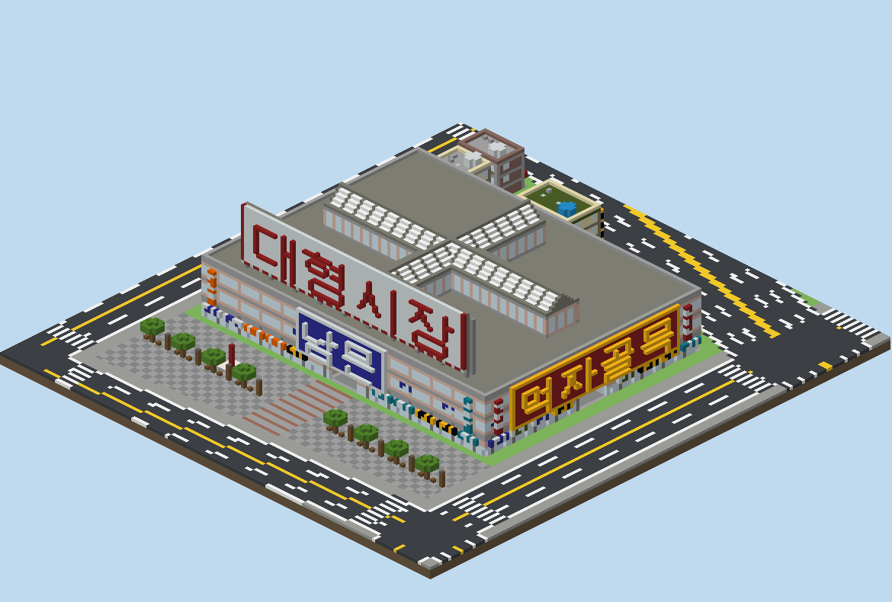
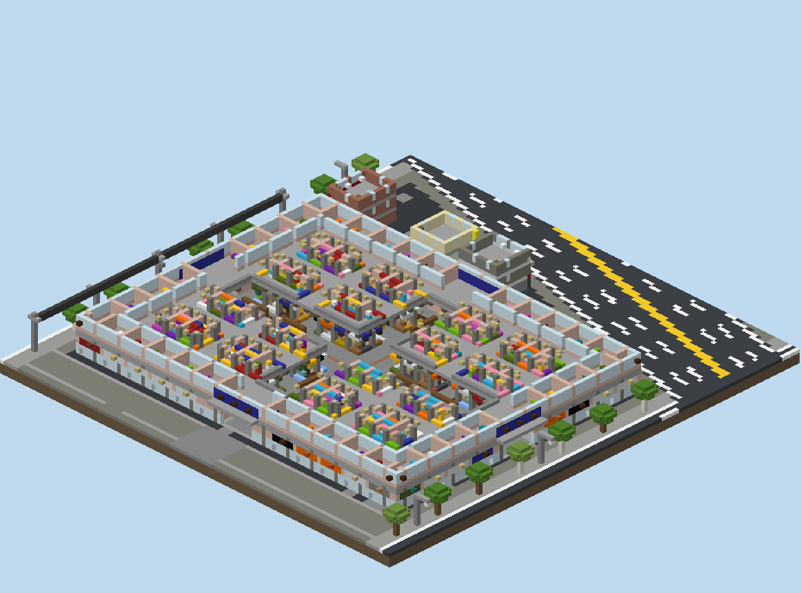
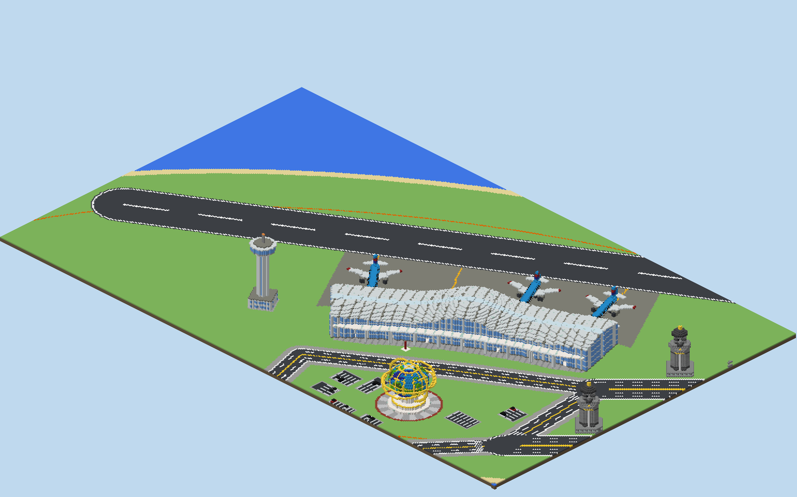
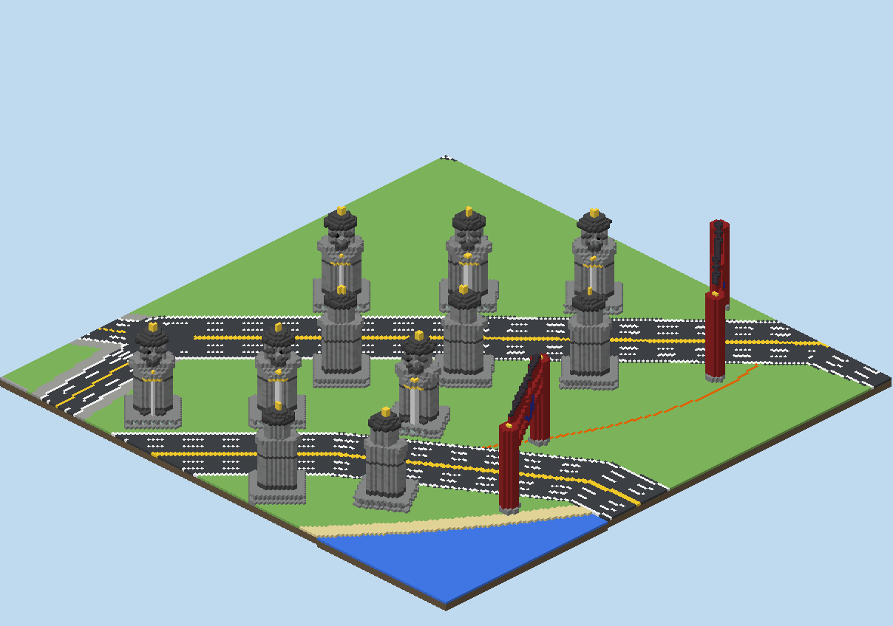
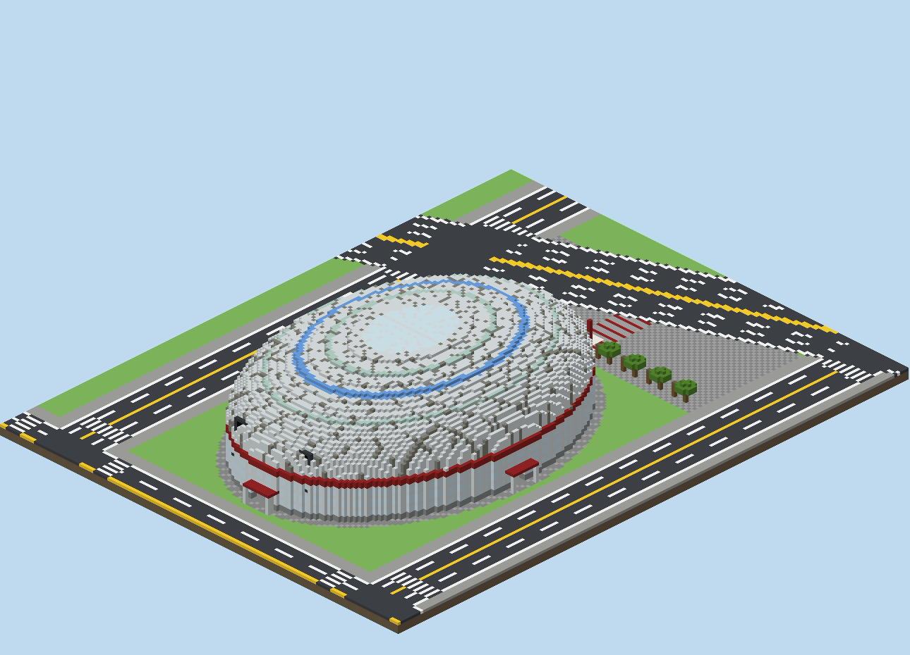
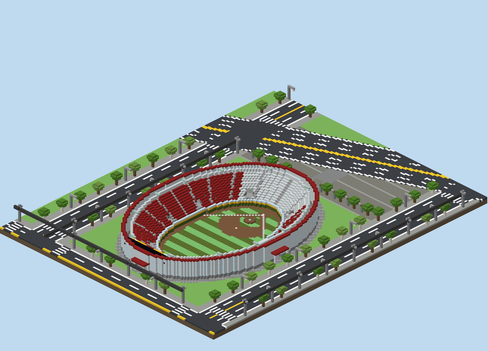
