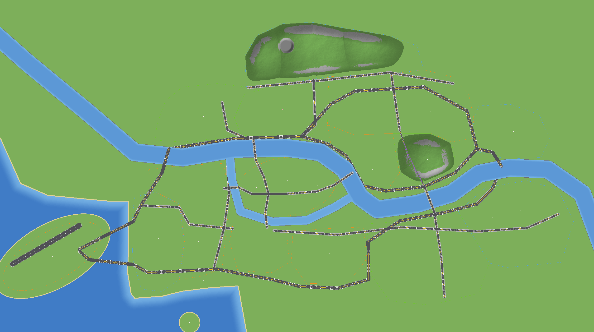

# 도시 바탕 생성기 (JunseoMapGen)

도시 설계도(`map/layout.json`)를 읽어서 **빈 도시 월드**를 자동으로 만드는 플러그인입니다.
**건축 서버(Paper)** 에서만 씁니다. 운영 서버(Folia)에는 완성된 월드만 복사합니다.



## 만들어 주는 것

| 항목 | 블록 |
|---|---|
| 땅 | 땅 윗면 Y 0, 잔디. 밑은 흙 → 돌 → 기반암(Y −64) |
| 한강·샛강 | 수면 Y −1. 한강 가운데는 10칸, 샛강은 4칸 깊이. 바닥은 자갈·모래·점토 |
| 한강 둑 | 석재 벽돌 |
| 바다 (서해) | 해안에서 멀어질수록 깊어짐(최대 20칸). 해변은 모래 |
| 도시 바깥 | 월드 경계(5×5km)까지는 깊은 바다. 섬 도시처럼 보입니다 |
| 공항 섬 | 해협으로 떨어진 섬. 고속도로 해협 대교 2개로 연결 |
| 교도소 섬 | 모래 해변이 있는 둥근 섬 |
| 남산·북한산 | 남산은 약 180m, 북한산은 약 220m. 높은 곳과 가파른 곳은 바위, 나머지는 숲 |
| 채석장 | 북한산 안의 평평한 바위 바닥(높이 30) |
| 고속도로 | 폭 28칸. 회색 콘크리트(아스팔트), 노란 중앙선 2칸, 흰 차선 점선, 바깥 실선 |
| 대로 | 폭 24칸. 왕복 4차로 + 양쪽 인도 4칸(밝은 회색) |
| 한강 다리 | 땅 높이(Y 0)에 상판, 가장자리 난간, 40칸마다 기둥 |
| 남산터널 | 산 밑을 뚫은 2차로 터널. 석재 벽돌 벽, 천장 조명 |
| 공항 활주로 | 폭 45칸, 흰 가운데 점선 |
| 구역 경계선 | 1차 오픈 주황, 2차 연두, 3차 하늘색 콘크리트 한 줄 |
| 거점 표시 | 석영 5×5 바닥 + 빨간 콘크리트 기둥 + 바다 랜턴 (공항 터미널, 여의도 광장 등) |

도시 구역 안에는 나무를 심지 않습니다. 건물을 지을 자리이기 때문입니다.

## 건축 서버에서 쓰기

1. **Paper 26.2** 서버를 준비합니다. 운영용과 다른 폴더에 둡니다.
2. `plugins/` 폴더에 다음을 넣습니다.
   - `JunseoMapGen-*.jar`: GitHub Actions의 `JunseoMapGen-plugin` 아티팩트
   - [Chunky](https://modrinth.com/plugin/chunky): 월드를 미리 생성
   - WorldEdit 등 건축 도구
3. 서버를 켜고 게임 안에서 아래를 입력합니다. **op 권한**이 필요합니다.
   ```
   /mapgen create
   ```
   `city` 월드가 만들어지고 공항 터미널로 이동합니다.
   - 처음 만들 때 건축하기 편하도록 늘 낮, 맑음, 몹 없음으로 설정합니다.
   - 서버를 다시 켜면 `city` 월드를 자동으로 다시 불러옵니다.
4. 도시 전체를 미리 생성합니다. 서버 콘솔에서 입력합니다.
   ```
   chunky world city
   chunky shape rectangle
   chunky center 0 0
   chunky radius 2500 1400
   chunky start
   ```
   - 약 5.5만 청크입니다. 컴퓨터 성능에 따라 십여 분에서 한 시간쯤 걸립니다.
   - 디스크는 1~2GB 정도 듭니다 [추론].

**기본 월드 자체를 도시로 만들려면** (게임 서버·테스트 서버용)
- `bukkit.yml`에 아래를 넣습니다.
  ```yaml
  worlds:
    world:
      generator: JunseoMapGen
  ```
- 기존 `world` 폴더를 지우고 서버를 켭니다.
- 처음 켤 때 한 번 몬스터가 나오지 않게 설정하고, 월드 경계를 겁니다. 낮과 밤은 그대로 바뀝니다.
- 이때 `/mapgen tp`와 `/mapgen create`는 새 월드를 만들지 않고 기본 월드를 씁니다.

### 명령어

| 명령어 | 하는 일 |
|---|---|
| `/mapgen create` | 도시 월드 만들기(또는 불러오기), 공항으로 이동 |
| `/mapgen tp <거점·구역>` | 그곳으로 이동. 예: `plaza`, `hospital`, `yeouido`, `gangnam` (Tab 키로 자동 완성) |
| `/mapgen where` | 지금 있는 구역과 가장 가까운 거점 |
| `/mapgen list` | 거점과 구역 목록 |

`/맵생성`으로도 쓸 수 있습니다.

## 설계도를 고쳤을 때
1. `plugins/JunseoMapGen/layout.json`을 고칩니다.
2. 서버를 다시 켭니다.
3. **이미 생성된 청크는 바뀌지 않습니다.**
   - 새로 생성되는 땅만 새 설계도를 따릅니다.
   - 전체를 다시 만들려면 `city` 월드를 지우고 `/mapgen create`부터 다시 합니다.
   - 건물을 짓기 시작한 뒤라면 고친 부분만 WorldEdit으로 손봅니다.

## 개발자용
- **지형 계산**
  - 위치: 공용 모듈 `citymap/`의 `CityTerrain`
  - 마인크래프트와 상관없는 순수 계산이라서 서버 없이 테스트합니다.
  - 본 플러그인의 미니맵도 같은 계산을 씁니다.
  - 테스트: `./gradlew :citymap:test`
- **위에서 내려다본 미리보기 그림**
  - `./gradlew :citymap:test -DmapPreview=true`를 실행하면 `citymap/build/preview/`에 생깁니다.
  - 전체는 1px = 2블록, 여의도·남산·공항은 1px = 1블록입니다.
